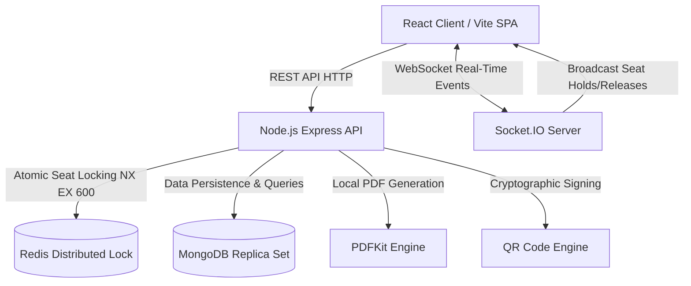

# 🚌 VeloxBus — Production MERN Bus Booking & Concurrency Platform

<div align="center">


**An enterprise-grade, 100% self-hosted bus reservation platform engineered with sub-millisecond Redis concurrency locking, live WebSocket seat state broadcasts, and offline cryptographic QR boarding passes.**

[Features](#-key-features) • [Architecture](#-system-architecture) • [Quick Start](#-quick-start-guide) • [API Reference](#-api-endpoints) • [Demo Credentials](#-demo-accounts) • [Docker Deployment](#-production-docker-deployment)

</div>

---

## 🌟 Key Features

### 1. ⚡ Zero-Collision Concurrency Engine (Redis Distributed Locks)
- **Sub-Millisecond Atomic Locking**: Uses Redis atomic `SET key val NX EX 600` locks to hold passenger seats for 10 minutes during checkout.
- **Race Condition Prevention**: Prevents two passengers from booking or paying for the same berth simultaneously.
- **Auto-Release & Rollback**: Abandoned carts are automatically rolled back when the 10-minute TTL expires.
- **Fault-Tolerant In-Memory Fallback**: Runs smoothly in local environments even when Redis is offline.

### 2. 📡 Real-Time WebSocket Synchronization
- **Live Seat Map**: Real-time status sync (*Available*, *Held*, *Booked*) across all connected browsers using **Socket.IO**.
- **Instant Toast Alerts**: Active passengers receive live alerts when other users hold or release seats on the same bus.

### 3. 🎟️ Offline Cryptographic QR & PDF Ticketing
- **100% Self-Hosted Generation**: Built-in PDF ticket generator using **PDFKit** (zero external cloud dependencies).
- **Offline QR Boarding Pass**: Cryptographically signed digital QR code embedded on ticket for offline conductor verification.
- **1-Click Cancellation & Refund**: Instant refund calculation and seat release engine.

### 4. 🇮🇳 Comprehensive Indian Intercity Bus Transit Network
- **41 Hub Cities**: Bangalore, Hyderabad, Mumbai, Goa, Delhi, Jaipur, Chennai, Kochi, Pune, Kolkata, and more.
- **49 Active Routes**: Real highway stops, travel durations, and realistic INR (`₹`) fares.
- **4 Operator Fleets**: *VRL National Travels*, *SRS Royal Lines*, *Orange Tours*, *Zingbus Smart EV*.
- **490+ Live Scheduled Departures**: AC Sleeper (2+1) and AC Executive Seater (2+2) layouts.

### 5. 👥 Multi-Role Portals & RBAC
- 👤 **Passenger Portal**: Route search, interactive berth selection, digital QR pass, trip cancellation & refund status.
- 🚌 **Operator Fleet & Manifest Portal (`/operator-services`)**: Live departure list, seat occupancy progress bars, passenger manifest with PNRs, fleet revenue analytics, and schedule publisher.
- 🛡️ **Super Admin Dashboard (`/admin-dashboard`)**: Master intercity route manager, operator onboarding, system telemetry.

### 6. 📱 100% Mobile Responsive Design
- Clean commercial light theme inspired by RedBus & MakeMyTrip.
- Tested and optimized across mobile viewports (320px–430px), tablets, and high-res desktops.

---

## 🏗️ System Architecture



---

## 🚀 Quick Start Guide (Local Development)

### Prerequisites
- **Node.js**: v18.0.0 or higher
- **MongoDB**: Local community server or Docker (`mongodb://localhost:27017/bus_booking_db`)
- **Redis** *(Optional)*: If Redis is not installed, the server seamlessly uses its local in-memory fallback.

---

### Step 1: Clone Repository & Install Dependencies

```bash
# Clone the repository
git clone https://github.com/YOUR_USERNAME/veloxbus.git
cd veloxbus

# 1. Install Backend Dependencies
cd backend
npm install

# 2. Install Frontend Dependencies
cd ../frontend
npm install
```

---

### Step 2: Seed the Database

Populate 41 Indian hub cities, 49 routes, 8 fleet buses, and 490 departure schedules:

```bash
cd backend
npm run seed
```

---

### Step 3: Run Development Servers

Open two terminal windows:

```bash
# Terminal 1: Start Backend API (Port 5000)
cd backend
npm run dev

# Terminal 2: Start Frontend Web App (Port 3000)
cd frontend
npm run dev
```

Visit **`http://localhost:3000`** in your browser.

---

## 🔑 Demo Accounts

Use the one-click demo buttons on `/login` or sign in with:

| Role | Email | Password | Access Capabilities |
|---|---|---|---|
| 🛡️ **Super Admin** | `admin@busbooking.local` | `password123` | Master routes, system oversight |
| 🚌 **Bus Operator** | `operator@expressbus.com` | `password123` | Fleet manager, schedules, passenger manifest |
| 👤 **Passenger** | `alex@gmail.com` | `password123` | Search, seat booking, ticket downloads |

---

## 📡 API Endpoints

### 🔐 Authentication (`/api/auth`)
| Method | Endpoint | Description | Auth Required |
|---|---|---|:---:|
| `POST` | `/api/auth/register` | Register new Passenger or Fleet Operator | No |
| `POST` | `/api/auth/login` | Sign in & receive JWT Bearer token | No |
| `GET` | `/api/auth/operators` | List registered fleet operators | Admin |

### 📍 Routes & Cities (`/api/routes`)
| Method | Endpoint | Description | Auth Required |
|---|---|---|:---:|
| `GET` | `/api/routes/cities` | Get distinct active origin & destination cities | No |
| `GET` | `/api/routes` | Get all system routes with stops & distance | No |
| `POST` | `/api/routes` | Add new intercity route | Admin |

### 🕒 Schedules & Departures (`/api/schedules`)
| Method | Endpoint | Description | Auth Required |
|---|---|---|:---:|
| `GET` | `/api/schedules/search` | Search trips by origin, destination & date | No |
| `GET` | `/api/schedules/:id` | Get schedule details & occupied seats | No |
| `GET` | `/api/schedules/operator-services` | Operator active departures & revenue | Operator / Admin |
| `POST` | `/api/schedules` | Publish new departure schedule | Operator / Admin |

### 🎟️ Bookings & Concurrency (`/api/bookings`)
| Method | Endpoint | Description | Auth Required |
|---|---|---|:---:|
| `POST` | `/api/bookings/hold` | Acquire 10-min atomic Redis hold lock | Yes |
| `POST` | `/api/bookings/confirm` | Confirm payment & generate QR ticket | Yes |
| `GET` | `/api/bookings/my-bookings` | Passenger booking history | Yes |
| `GET` | `/api/bookings/operator-bookings` | Operator passenger manifest roster | Operator / Admin |
| `GET` | `/api/bookings/ticket/:pnr` | Download PDF ticket pass | Yes |
| `POST` | `/api/bookings/cancel/:pnr` | Cancel booking & release seats | Yes |

---

## 🐳 Production Docker Deployment

Deploy the entire production topology (Nginx Reverse Proxy, React, Express, MongoDB, Redis) with a single command:

```bash
docker-compose up --build -d
```

- **Frontend App**: `http://localhost`
- **Backend API**: `http://localhost/api`
- **Health Check**: `http://localhost/api/health`

---

## 📂 Project Structure

```
veloxbus/
├── backend/
│   ├── src/
│   │   ├── config/          # MongoDB & Redis client configurations
│   │   ├── controllers/     # Auth, Bus, Route, Schedule, Booking handlers
│   │   ├── middleware/      # JWT Protect & RBAC role authorization
│   │   ├── models/          # User, Bus, Route, Schedule, Booking schemas
│   │   ├── routes/          # Express REST API routes
│   │   ├── seeders/         # Database seeder (41 Indian cities, 49 routes)
│   │   ├── services/        # Redis hold locks, PDFKit tickets, QR & WebSockets
│   │   └── server.ts        # Express HTTP & Socket.IO server
│   ├── package.json
│   └── tsconfig.json
├── frontend/
│   ├── src/
│   │   ├── components/      # Navbar, Footer, SeatMap, ProtectedRoute
│   │   ├── context/         # AuthContext (JWT session state)
│   │   ├── pages/           # Home, SearchResults, Checkout, Ticket, Dashboards, About, Contact
│   │   ├── services/        # Axios API & Socket.io WebSocket client
│   │   └── App.tsx
│   ├── package.json
│   └── vite.config.ts
├── docker-compose.yml       # Production multi-container orchestration
├── .gitignore
└── README.md
```

---

## 📄 License

This project is licensed under the **MIT License**.
